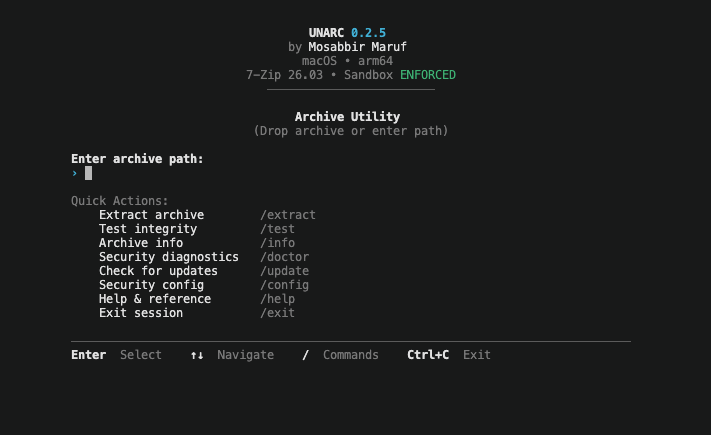

<div align="center">

# Unarc

**An open-source, production-grade, security-focused archive utility CLI in Rust.**

<p align="center">
  Targeting <b>macOS Apple Silicon</b> (<code>aarch64-apple-darwin</code>), <b>Linux</b> (<code>x86_64</code>, <code>aarch64</code>), and <b>Docker</b> distroless container runtime. Zero-trust path containment, interactive terminal UX, deterministic exit codes, and an authentic bundled engine (<code>7zz v26.03</code>).
</p>

<p align="center">
  <b>Developer:</b> <a href="https://github.com/mosabbir-maruf" target="_blank" rel="noopener noreferrer">Mosabbir Maruf</a> &nbsp;|&nbsp;
  <b>Engine:</b> <a href="https://www.7-zip.org" target="_blank" rel="noopener noreferrer">7-Zip (7zz v26.03)</a> &nbsp;|&nbsp;
  <b>License:</b> <a href="LICENSE">MIT</a>
</p>

<p align="center">
  <a href="https://github.com/mosabbir-maruf/Unarc/releases/latest" target="_blank" rel="noopener noreferrer"></a>
  <a href="https://github.com/mosabbir-maruf/Unarc/actions" target="_blank" rel="noopener noreferrer"></a>
  <a href="https://doc.rust-lang.org" target="_blank" rel="noopener noreferrer"></a>
  <a href="https://www.7-zip.org" target="_blank" rel="noopener noreferrer"></a>
  <a href="https://github.com/mosabbir-maruf/Unarc/pkgs/container/unarc" target="_blank" rel="noopener noreferrer"></a>
  <a href="LICENSE"></a>
</p>

<br />



</div>

---

## Quick Start

Unarc provides 3 primary ways to install and run. Choose the path that matches your environment:

| Method | Target Platform | Prerequisites | Best For |
|---|---|---|---|
| [**1. Native — Manual Installation**](#1-native--manual-installation) | macOS Apple Silicon, Linux (`x86_64`, `aarch64`) | None | Direct binary download & custom PATH setup |
| [**2. Native — Scripted Installation**](#2-native--scripted-installation) | macOS Apple Silicon, Linux (`x86_64`, `aarch64`) | `curl`, `shasum` | Fast one-step terminal installation & verification |
| [**3. Docker**](#3-docker) | Any OS with Docker runtime | Docker | Isolated, zero-install container execution |

After installing, see [**First Run**](#first-run) for verification, macOS Gatekeeper handling, and getting started.

---

## 1. Native — Manual Installation

Unarc is distributed as a single, self-contained native executable embedding the authentic, pinned `7zz v26.03` engine. No Rust, Cargo, 7-Zip, Homebrew, or runtime dependencies are required.

### Supported Platforms
- **macOS Apple Silicon**: `macos-arm64` (`aarch64-apple-darwin`)
- **Linux x86_64**: `linux-x86_64` (`x86_64-unknown-linux-gnu`)
- **Linux ARM64**: `linux-aarch64` (`aarch64-unknown-linux-gnu`)

### Download & PATH Setup

1. Download the standalone executable matching the `unarc-<version>-<platform>` pattern from [GitHub Releases](https://github.com/mosabbir-maruf/Unarc/releases/latest):
   - `unarc-0.2.5-macos-arm64` (macOS Apple Silicon)
   - `unarc-0.2.5-linux-x86_64` (Linux x86_64)
   - `unarc-0.2.5-linux-aarch64` (Linux ARM64)

2. Make executable and run directly, or install into your `PATH`:
   ```bash
   # If running from the download directory:
   xattr -d com.apple.quarantine ./unarc-0.2.5-macos-arm64

   # If installed to PATH:
   xattr -d com.apple.quarantine ~/.local/bin/unarc

   # Make executable and run directly:
   chmod +x ./unarc-0.2.5-macos-arm64
   ./unarc-0.2.5-macos-arm64

   # Recommended PATH installation (run 'unarc' from anywhere):
   mkdir -p ~/.local/bin
   mv ./unarc-0.2.5-macos-arm64 ~/.local/bin/unarc
   unarc
   ```

> [!TIP]
> Ensure `~/.local/bin` is in your `PATH` (e.g. `export PATH="$HOME/.local/bin:$PATH"` in `~/.zshrc` or `~/.bashrc`).

*(Note: Package maintainers can also find `.tar.gz` bundles containing documentation and licenses on the releases page. For verification and macOS Gatekeeper guidance, proceed to [First Run](#first-run).)*

---

## 2. Native — Scripted Installation

Download, verify the SHA-256 digest, install into `~/.local/bin`, and verify in a single Terminal workflow:

```bash
PLATFORM="macos-arm64" # Options: macos-arm64, linux-x86_64, linux-aarch64
VERSION="0.2.5"

# 1. Download binary and SHA-256 checksum
curl -sSLO "https://github.com/mosabbir-maruf/Unarc/releases/download/v${VERSION}/unarc-${VERSION}-${PLATFORM}"
curl -sSLO "https://github.com/mosabbir-maruf/Unarc/releases/download/v${VERSION}/unarc-${VERSION}-${PLATFORM}.sha256"

# 2. Verify checksum
shasum -a 256 -c "unarc-${VERSION}-${PLATFORM}.sha256" # On Linux use: sha256sum -c

# 3. Install into PATH
mkdir -p ~/.local/bin
mv "unarc-${VERSION}-${PLATFORM}" ~/.local/bin/unarc
chmod 0755 ~/.local/bin/unarc
rm -f "unarc-${VERSION}-${PLATFORM}.sha256"

# 4. Verify installation
unarc version
unarc doctor
```

> [!TIP]
> Ensure `~/.local/bin` is in your `PATH` (e.g. `export PATH="$HOME/.local/bin:$PATH"` in `~/.zshrc` or `~/.bashrc`).

---

## 3. Docker

Published on GitHub Container Registry as an ultra-minimal distroless container (`ghcr.io/mosabbir-maruf/unarc:latest`).

### Interactive Mode (Default)
Mounting `$PWD` to `/work` allows working with files in your current directory:
```bash
docker run -it --rm -v "$PWD:/work" ghcr.io/mosabbir-maruf/unarc:latest
```

### Direct CLI Subcommands
```bash
# Test archive integrity
docker run --rm -v "$PWD:/work" ghcr.io/mosabbir-maruf/unarc:latest test archive.zip

# Extract archive
docker run --rm -v "$PWD:/work" ghcr.io/mosabbir-maruf/unarc:latest extract archive.zip --output out

# System and engine diagnostics
docker run --rm ghcr.io/mosabbir-maruf/unarc:latest doctor
```

### Hardened Maximum-Security Mode
For automated CI/CD pipelines or untrusted multi-tenant archives:
```bash
docker run --rm --network none --read-only --cap-drop ALL \
  -v "$PWD/archive.zip:/input/archive.zip:ro" \
  -v "$PWD/output:/output:rw" \
  ghcr.io/mosabbir-maruf/unarc:latest \
  extract /input/archive.zip --output /output
```
- `--network none`: Disables container network stack at the kernel level.
- `--read-only`: Enforces read-only root filesystem.
- `--cap-drop ALL`: Drops all Linux kernel capabilities.
- `:ro` and `:rw` volume boundaries: Confines archive read to `:ro` and output writes exclusively to `:rw`.

---

## First Run

Follow this onboarding runbook after installing Unarc.

### Verify Installation

Confirm that Unarc is installed and inspect system diagnostics:

```bash
unarc version
```

Expected result:
```text
unarc 0.2.5
```

Run doctor diagnostics to verify engine integrity and platform capabilities:

```bash
unarc doctor
```

Expected result:
```text
System Diagnostics Doctor: [HEALTHY]
  Platform:       macos-aarch64 (or linux-x86_64 / linux-aarch64)
  Pinned Engine:  v26.03
  Diagnostic Probes:
    [PASS] Platform Detection
    [PASS] Bundled Engine Resolution
    [PASS] Engine Execution Probe
    ...
```

### macOS Gatekeeper — First Run

When downloading standalone binaries on macOS via browser or `curl`, Apple's Gatekeeper subsystem attaches an extended quarantine attribute (`com.apple.quarantine`). Because current releases are unsigned open-source binaries, macOS may prompt that the developer cannot be verified.

1. **Verify the official SHA-256 digest**:
   ```bash
   shasum -a 256 -c unarc-0.2.5-macos-arm64.sha256
   ```
2. **Clear the quarantine attribute only from the verified Unarc binary**:
   ```bash
   # If running from download directory:
   xattr -d com.apple.quarantine ./unarc-0.2.5-macos-arm64

   # If installed to PATH:
   xattr -d com.apple.quarantine ~/.local/bin/unarc
   ```
3. **Run the executable and verify it works**:
   ```bash
   ./unarc-0.2.5-macos-arm64 version
   # or
   unarc doctor
   ```

> [!CAUTION]
> **Never disable Gatekeeper globally** (e.g. `spctl --master-disable`). Only clear the quarantine attribute on the specific verified Unarc binary.

### Start Using Unarc

Launch Unarc without arguments to enter interactive mode:

```bash
unarc
```

Or extract an archive directly:

```bash
unarc extract archive.zip --output ./out
```

---

## Restore Gatekeeper Quarantine

Restoring the Gatekeeper quarantine attribute is an optional post-use action:
- **Optional**: Intended for users who temporarily removed `com.apple.quarantine` to run the current unsigned/unnotarized release.
- **Targeted**: Restores the quarantine attribute specifically on the verified Unarc binary.
- **Not System-Wide**: This is **not** a global Gatekeeper restore or enable operation (`spctl` settings are untouched).

Re-apply the quarantine attribute:

```bash
# If installed to PATH:
xattr -w com.apple.quarantine "0083;$(printf '%x' $(date +%s));Unarc;" ~/.local/bin/unarc

# If running from download directory:
xattr -w com.apple.quarantine "0083;$(printf '%x' $(date +%s));Unarc;" ./unarc-0.2.5-macos-arm64
```

Verify that the quarantine attribute is present:

```bash
xattr -l ~/.local/bin/unarc
```

Expected output:
```text
com.apple.quarantine: 0083;...;Unarc;
```

If `com.apple.quarantine` is present, the quarantine attribute has been restored.

---

## Basic Usage

Unarc provides a streamlined progression: **Install → Verify → First Run → Use**.

### Interactive Mode (TUI)

Running `unarc` without arguments launches the interactive terminal interface:

```text
                        UNARC 0.2.5
                     by Mosabbir Maruf
                      macOS • arm64
               7-Zip 26.03 • Sandbox ENFORCED
                  ────────────────────────

                      Archive Utility
                (Drop archive or enter path)

  Enter archive path:
  › 

  Quick Actions:
      Extract archive        /extract
      Test integrity         /test
      Archive info           /info
      Security diagnostics   /doctor
      Check for updates      /update
      Security config        /config
      Help & reference       /help
      Exit session           /exit

  ────────────────────────────────────────────────────────
  Enter  Select    ↑↓  Navigate    /  Commands    Ctrl+C  Exit
```

- **Command Palette**: Press `/` to open the interactive command palette (`/extract`, `/test`, `/info`, `/doctor`, `/update`, `/config`, `/help`, `/exit`) with real-time autocompletion.
- **Keyboard Navigation**: Use arrow keys (`↑`/`↓`) to navigate quick actions and suggestions, `Tab` to autocomplete, and `Enter` to execute.
- **Drag-and-Drop**: Dragging an archive file into the terminal automatically detects the path and presents contextual one-click actions (`[E]xtract`, `[T]est`, `[C]ancel`).

### Direct CLI Subcommands

| Subcommand | Description | Example |
|---|---|---|
| `extract <ARCHIVE>` | Securely extracts archive with path traversal and containment verification. | `unarc extract archive.zip --output ./out` |
| `test <ARCHIVE>` | Tests archive integrity without writing extracted files to disk. | `unarc test archive.7z` |
| `info` | Displays platform architecture, bundled engine version, and active security policy. | `unarc info` |
| `doctor` | Runs end-to-end diagnostics, engine integrity checks, and sandbox boundary probes. | `unarc doctor` |
| `update` | Checks for or applies cryptographically signed self-updates (native binaries only). | `unarc update --check` |
| `version` | Displays the current Unarc version string. | `unarc version` |

**Global Flags**:
- `--json`: Formats output as structured JSON.
- `-v, --verbose`: Increases output verbosity.
- `-q, --quiet`: Suppresses non-essential terminal output.

#### Self-Update (`unarc update` / `/update`)

Unarc provides a cryptographically authenticated self-update mechanism for native installations:

- **What It Downloads**: Downloads the standalone executable binary directly from GitHub Releases (e.g. `unarc-<version>-macos-arm64` on Apple Silicon). It does **not** download Docker container images or archive tarballs.
- **Docker Updates**: Docker environments do not use `unarc update`; update by pulling the latest container image (`docker pull ghcr.io/mosabbir-maruf/unarc:latest`).
- **Cryptographic Verification**: Before replacing any executable, Unarc fetches the release manifest, verifies its Ed25519 signature against the embedded official public key (`90cd97db...`), validates host architecture compatibility, verifies the downloaded binary's SHA-256 hash against the manifest, and validates Mach-O/ELF binary format headers.
- **Atomic Replacement & Staging Cleanup**: Stages the verified binary alongside the running executable and applies it via atomic POSIX `rename(2)`. If network transfer, signature verification, checksum validation, or format checks fail, the temporary staging file is deleted immediately by an RAII cleanup guard and the existing binary remains untouched. Updates through symlinks are rejected for security.
- **Execution Modes**:
  - `unarc update --check`: Checks for updates and reports availability without downloading or replacing the binary.
  - `unarc update`: Checks, downloads, verifies, and installs the update.
  - Interactive TUI (`/update`): Checks for updates and prompts for confirmation (`[y/N]`) before applying.

---

## Advanced / Reference

Authoritative technical documentation, security policies, format capabilities, exit codes, and operational reference.

### Security Architecture

Unarc enforces a multi-layered zero-trust security model:

- **Path Traversal Protection (`Zip Slip`)**: Rejects path traversal sequences (`../`), absolute paths (`/etc/...`), null bytes, or paths escaping the extraction destination.
- **Unsafe Entry Blocking**: Rejects symlinks, hardlinks, device nodes, FIFOs, and sockets by default.
- **Output Boundary Containment**: Validates that all extracted files resolve strictly within the canonical target destination before writing.
- **Hermetic Pinned Engine (`7zz v26.03`)**: Pinned authentic 7-Zip engine embedded at compile time, materialized on-demand into a restricted temporary directory (`0700` directory, `0500` non-writable binary), and verified against its official SHA-256 hash before execution.
- **OS-Level Sandboxing**:
  - *macOS*: Apple Seatbelt (`sandbox-exec`) kernel confinement denies network access and restricts filesystem access strictly to input archive and output destination.
  - *Linux*: Process group isolation, purged ambient environment, `PR_SET_NO_NEW_PRIVS`, and `PR_SET_PDEATHSIG` (terminates engine if parent process exits).
  - *Docker*: Runs strictly as unprivileged user `65532:65532` in a distroless image containing zero shells or compilers.
- **Cryptographic Trust Anchor**: Official updates verify Ed25519 signatures against an embedded trust anchor public key (`90cd97dbf43425cb694d386cb89f2e04fa252fafa6bffddddfc2f3fc962a94ee`) with atomic replacement via `rename(2)` and safe staging cleanup.

### Password-Protected Archives

Unarc implements an ephemeral, zero-leakage password handling policy:

- **Interactive Masked Prompt**: Prompts for password with masked input (`rpassword`) without echo.
- **Zero Process Argument Exposure**: Passwords are piped directly to the engine via standard input (`stdin`) and flushed immediately; passwords **never** appear in `ps`, `/proc`, shell history, or process argument lists (`-p<password>` is never used).
- **No CLI Argument or Environment Variable**: Unarc does **not** provide `--password` / `-p` flags and does **not** read `UNARC_PASSWORD`, preventing credential leakage across process trees.
- **Zero Persistence**: Passwords exist solely in ephemeral memory during the operation and are never written to disk, caches, or logs.
- **Deterministic Exit Codes**:
  - Non-interactive / closed stdin: fails closed with exit code `16` (`PASSWORD_REQUIRED`).
  - Incorrect password: fails with exit code `17` (`INVALID_PASSWORD`).
  - Correct password: exits with code `0` (`SUCCESS`).

### Supported Formats

| Format | Extensions | Capabilities |
|---|---|---|
| **ZIP** | `.zip` | Deflate, BZIP2, LZMA, AES encryption |
| **7-Zip** | `.7z` | LZMA, LZMA2, PPMd, BCJ, AES-256 |
| **TAR** | `.tar` | POSIX tar archives |
| **Compressed TAR** | `.tar.gz`, `.tgz`, `.tar.bz2`, `.tbz2`, `.tar.xz`, `.txz` | Gzip, Bzip2, and XZ compression |
| **RAR** | `.rar` | RAR 4.x legacy and RAR 5.x, including multipart volumes (`.part1.rar`, `.r00`) |

### Exit Codes

Unarc returns deterministic exit codes for scripting and automation:

| Code | Identifier | Description |
|---|---|---|
| `0` | `SUCCESS` | Operation completed successfully |
| `2` | `CLI_ERROR` | Invalid command line arguments or flags |
| `10` | `INPUT_NOT_FOUND` | Archive file does not exist |
| `11` | `INPUT_NOT_FILE` | Archive path points to a directory or non-regular file |
| `12` | `UNSUPPORTED_FORMAT` | Archive format is unsupported or unknown |
| `13` | `MISSING_VOLUME` | Multipart sequence is missing a required volume |
| `14` | `INVALID_VOLUME` | Sibling volume is corrupt, not a file, or invalid |
| `15` | `CORRUPT_ARCHIVE` | Archive data or header is corrupted |
| `16` | `PASSWORD_REQUIRED` | Archive is password-protected and no password was supplied |
| `17` | `INVALID_PASSWORD` | Supplied archive password is incorrect |
| `18` | `OUTPUT_INVALID` | Extraction output destination is invalid or a non-directory file |
| `20` | `PATH_TRAVERSAL` | Archive contains entries attempting Zip Slip path traversal |
| `21` | `UNSAFE_ENTRY` | Archive contains unauthorized symlinks, hardlinks, or special nodes |
| `22` | `SECURITY_POLICY_VIOLATION` | Sandbox or execution boundary constraint violated |
| `30` | `PERMISSION_DENIED` | Filesystem permission denied during read or write operations |
| `40` | `EXTRACTION_FAILED` | Archive extraction failed |
| `41` | `ENGINE_FAILED` | Internal bundled archive engine failed to execute |
| `130` | `INTERRUPTED` | Execution interrupted by SIGINT / SIGTERM signal |

### Developer / Build From Source

Building from source requires the Rust toolchain (Rust 1.85.0+):

```bash
# Clone and build
git clone https://github.com/mosabbir-maruf/Unarc.git
cd Unarc
cargo build --release

# Run interactive TUI directly from built binary:
./target/aarch64-apple-darwin/release/unarc  # (on macOS Apple Silicon)
# or
./target/release/unarc                      # (standard release path)
# or
make run                                    # (via Makefile shortcut)
```

#### Developer Workflow & Makefile Commands

Unarc includes a `Makefile` that wraps the containerized dev toolchain (`./scripts/dev.sh`) for fast local development and automated CI checks:

```bash
# Automated verification suite (fmt-check, clippy, tests, release build)
make check

# Launch interactive UI / run binary
make run          # Launch interactive TUI session (or: make run ARGS="--help")

# Code formatting & linting
make fmt          # Automatically format code
make fmt-check    # Check formatting without modifying files
make clippy       # Run Clippy linter with warnings denied (-D warnings)

# Testing & compilation
make test         # Run unit and integration tests
make build        # Compile debug binary
make release      # Compile optimized release binary
make bench        # Run performance benchmarks

# Docker images & cleanup
make docker-build # Build development Docker container image (unarc-dev)
make docker-prod  # Build hardened distroless production container (unarc:latest)
make clean        # Remove local build artifacts (target/)
```

You can also run the underlying helper scripts directly:

```bash
# Direct dev script invocation
./scripts/dev.sh check
./scripts/dev.sh test
./scripts/dev.sh fmt
./scripts/dev.sh clippy

# Containerized runtime verifications
./scripts/verify-docker.sh unarc:latest
./scripts/verify-security.sh
```

### Troubleshooting

#### 1. macOS Gatekeeper Quarantine
If macOS blocks execution with an alert stating developer cannot be verified, verify the SHA-256 digest and remove the quarantine attribute:
```bash
xattr -d com.apple.quarantine ~/.local/bin/unarc
```
See [macOS Gatekeeper — First Run](#macos-gatekeeper--first-run) for details.

#### 2. Docker Volume Permissions
If extraction inside Docker fails with `Permission denied` (`30`), ensure the mounted output directory is writable by unprivileged container user `65532:65532` (e.g. `chmod 777 ./out` or adjust directory ownership).

#### 3. Password-Protected Archive in Non-Interactive Mode
Non-interactive scripts extracting encrypted archives fail closed with exit code `16` (`PASSWORD_REQUIRED`). Run in an interactive terminal (`docker run -it ...` or native terminal) to supply the password.

#### 4. Missing or Corrupt Multipart Volumes
When extracting multipart volumes (`.part1.rar`, `.r00`), ensure all constituent volume files reside in the same folder. Missing volumes return exit code `13`; corrupt volumes return exit code `14`.

#### 5. Engine Resolution Priority
Unarc resolves its engine in strict order:
1. `UNARC_BUNDLED_7ZZ` environment variable override.
2. Adjacent `7zz` binary in the same directory.
3. Container engine at `/opt/unarc/bin/7zz`.
4. Embedded authentic `7zz` engine (automatically materialized to private temporary directory).

### Uninstall

Because Unarc is a self-contained standalone executable with no background services or system hooks:

- **For a PATH installation**:
  ```bash
  rm ~/.local/bin/unarc
  command -v unarc || echo "Unarc removed"
  ```
- **For a directly downloaded standalone binary**:
  Simply delete the downloaded binary file (e.g. `rm ./unarc-0.2.5-macos-arm64`).

### Privacy & Local Storage

Unarc operates with a strict zero-telemetry, zero-persistence model:
- **No Background Services**: Never installs daemons, helpers, or background watchers.
- **No Telemetry**: Collects zero analytics, metrics, or usage tracking.
- **No Persistent Credentials**: Never saves passwords to disk, caches, keychain, configuration files, or logs.
- **Air-Gapped & Offline**: Operates completely self-contained without cloud or backend dependencies.
- **Zero Runtime Downloads for Archive Operations**: Core archive operations (extract, test, info, doctor) never fetch binaries, engines, or dependencies over the network at runtime. (Self-update via `unarc update` connects to GitHub Releases only when explicitly invoked by the user.)
- **Ephemeral Operation Data**: Cleans temporary operation data (such as isolated sandbox staging workspaces) upon operation completion.

### License & Third-Party Notices

Unarc is open-source software licensed under the **[MIT License](LICENSE)**.

- **Unarc Codebase**: Licensed under the MIT License (see [LICENSE](LICENSE)). Copyright (c) 2026 Mosabbir Maruf.
- **Bundled Engine (7-Zip / 7zz)**: Pinned 7-Zip (`7zz v26.03`) is developed by Igor Pavlov and licensed under the **GNU LGPL v2.1+** (with the unRAR license restriction for RAR decompression and BSD/Public Domain portions for LZMA and 7z).
- **Third-Party Dependencies**: Complete notices and dependency attributions are available in [THIRD-PARTY-NOTICES.md](THIRD-PARTY-NOTICES.md).
